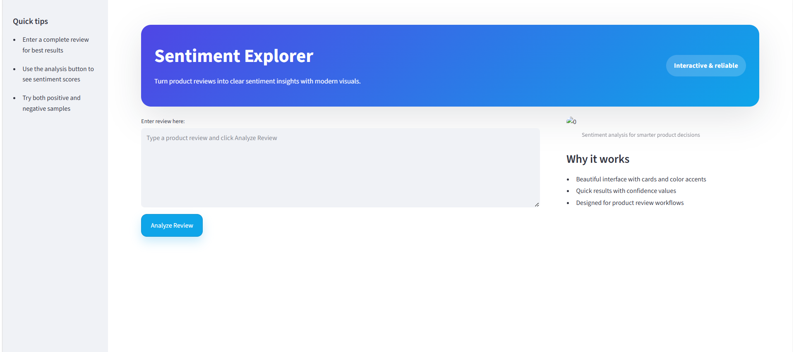
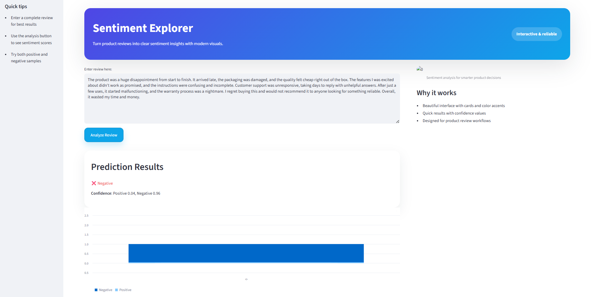

# Sentiment Analysis of Product Reviews

## 📌 Project Overview
This project is an end-to-end **Sentiment Analysis system** that classifies customer product reviews as **Positive** or **Negative** using Natural Language Processing (NLP) and Machine Learning techniques.

The application is built using **Python**, trained with **Logistic Regression**, and deployed as an interactive **Streamlit web application**.

---

## 🎯 Problem Statement
Online platforms receive thousands of customer reviews daily. Manually analyzing sentiment is time-consuming and error-prone.  
This project automates sentiment classification to help businesses understand customer feedback efficiently.

---

## 🧠 Solution Approach
1. Text preprocessing (cleaning, normalization)
2. Feature extraction using **TF-IDF Vectorization**
3. Model training using **Logistic Regression**
4. Model evaluation using accuracy, precision, recall, and F1-score
5. Web-based deployment using **Streamlit**

---

## 📊 Dataset
- **Dataset Name:** Women’s Clothing E-Commerce Reviews
- **Source:** Public Kaggle Dataset
- Raw data is excluded from this repository to maintain repository cleanliness.

---

## ⚙️ Tech Stack
- **Language:** Python
- **Libraries:** Pandas, NumPy, Scikit-learn, NLTK
- **Model:** Logistic Regression
- **Vectorization:** TF-IDF
- **Deployment:** Streamlit
- **Version Control:** Git & GitHub

---

## 📁 Project Structure
Sentiment Analysis of Product Reviews
|__app/
|   └── app.py
|___data/
|   ├── raw/
|   └── processed/
|___models/
|___notebooks/
|   ├── 01_data_loading.ipynb
|   ├── 02_preprocessing.ipynb
|   ├── 03_eda.ipynb
|   ├── 04_model_training.ipynb
|   ├── 05_evaluation.ipynb
|___README.md
|___.gitignore

---

## 🚀 How to Run Locally

1. Clone the repository:
git clone https://github.com/iradhika787/sentiment-analysis-product-reviews.git

2. Navigate to the project directory:
cd sentiment-analysis-product-reviews

3. Create and activate a virtual environment:
python -m venv venv
venv\Scripts\activate

4. Install required dependencies:
pip install -r requirements.txt

5. Run the Streamlit application:
streamlit run app/app.py

---

## 🖼️ Demo Screenshots

*Sentiment Explorer homepage with the review input and sidebar.*

*Prediction result showing sentiment label, confidence score, and chart.*
